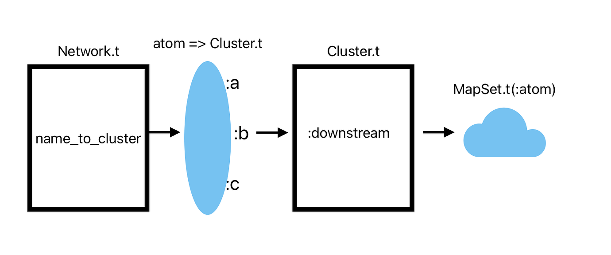

# For `Access` novices

Languages like Elixir don't let you change data structures; instead,
you create a new data structure that's different from the
original. That can be somewhat annoying when you want to change a
single place within a deeply nested structure. From now on, I'm
going to call such structures *containers*. We're interested in nested
containers.

Here's a simple example. We have `Network` structure. It has various
fields, one of which is named `:name_to_cluster`. A `Cluster`
structure has various fields, one of which, `:downstream`, holds a
`MapSet` of atoms (cluster names). Like this:



We want to add the value `:c` to
a single mapset. This code works:


```elixir
    new_cluster =
      network.name_to_cluster[:gate]
      |> Map.update!(:downstream, & MapSet.put(&1, :some_name))

    new_map =
      network.name_to_cluster
      |> Map.put(:gate, new_cluster)

    %{network | name_to_cluster: new_map}
```

Fine, but what I'm doing has two conceptual steps:

1. Point at the place you want to change.
2. Cause the change.

In the above code, those two steps are buried inside a lot of
bookkeeping code that does the work of constructing each level of the
new nested container. What really matters are highlighted below: the
path and the `MapSet.put` use.


We want the compiler to write the bookkeeping code for us, inserting
the path and update function.

You probably know that Elixir offers the `Access` behaviour that does
just that. Here's a better implementation of the above:

```elixir
    update_in(network.name_to_cluster[:gate].downstream,
              & MapSet.put(&1, :some_name))
```

Looks pretty clear: every word is about either the path or the
operation to be done on what's at the end. Alternately, we can use
syntax that's a little longer but not as reliant on macro magic to
describe the path:

```elixir
    path = [Access.key(:name_to_cluster), :gate, Access.key(:downstream)]
    update_in(network, path,
              & MapSet.put(&1, :some_name))
```

So where do lenses come in?

Well, let's say we want to add `:some_name` to *all* the clusters. I
was surprised that you couldn't do that with a single `update_in`
because I thought `Access.all/0` would do it. Something like:

```elixir
    path = [Access.key(:name_to_cluster),
            Access.all(),    # `all` will produce list of {key, value} tuples.
            Access.elem(1)]  # Take the value
```

But no joy:

```
** (RuntimeError) Access.all/0 expected a list, got: %{gate: %Cluster{downstream: MapSet.new([:big_edit, :has_fragments]), name: :gate}, watcher: %Cluster{downstream: MapSet.new([]), name: :watcher}}
```

(I don't know why `Access.all` is restricted to lists.)

To handle multiple clusters, you need some kind of a loop, perhaps
using `for`. `for` does what I expected `Access.all` to do, and
produces tuples:


```elixir
    new_map =
      for {name, cluster} <- network.name_to_cluster, into: %{} do
        new_cluster = update_in(cluster.downstream, & MapSet.put(&1, :some_name))
        {name, new_cluster}
      end
    %{network | name_to_cluster: new_map}
```

There are a variety of other looping or recursive styles you could use. (Actually,
that's sort of a problem: it would be better to have one concise
solution than, say, four that are long enough you actually have to
think to write them or, sometimes, read them.)


In this `Lens2` package (and others like it), updating multiple
clusters in the network doesn't require a loop:

```elixir
   lens = Lens.key(:name_to_cluster) |> Lens.map_values |> Lens.key(:downstream)
   #                                    ^^^^^^^^^^^^^^^
   Deeply.update(network, lens, & MapSet.update(&1, :some_name))
```

As it should, it looks almost the same to update a *subset* of the clusters:

```elixir
   lens = Lens.key(:name_to_cluster) |> Lens.keys([:gate, :watcher]) |> Lens.key(:downstream)
   #                                    ^^^^^^^^^^^^^^^^^^^^^^^^^^^
   Deeply.update(network, lens, & MapSet.update(&1, :some_name))
```

Or, if you prefer, you can use `update_in`, because lenses are
functions that implement the behavior that `Access` requires;


```elixir
    path = [Access.key(:name_to_cluster),  # Note Access
            Lens.keys([:gate, :watcher]),  # Note Lens
            Access.key(:downstream)]
    update_in(network, path, & MapSet.put(&1, :some_name))
```

This would be more compelling, I guess, if I were using maps instead
of structs. With maps, you can avoid `Access.key`:


```elixir
    path = [:name_to_cluster,
            Lens.keys([:gate, :watcher]),
            :downstream]
    update_in(network, path, & MapSet.put(&1, :some_name))
```

I personally just use `Deeply` everywhere except when the
`dot.and[bracket].notation` fits too well to pass up. I tend to avoid
nested structures that expose the structure of their innards to all
their clients, so that's not as often as you might guess.

You *can*, however, read this series as descriptions of how to create
custom path elements for `update_in` and friends (the way `Lens.keys`
was used above). You can do that directly by writing functions that
match the required `Access` behaviour, but since lenses *are*
functions that match that behaviour, maybe learning lenses is still
worthwhile, if only for the greater variety of prepackaged functions.
