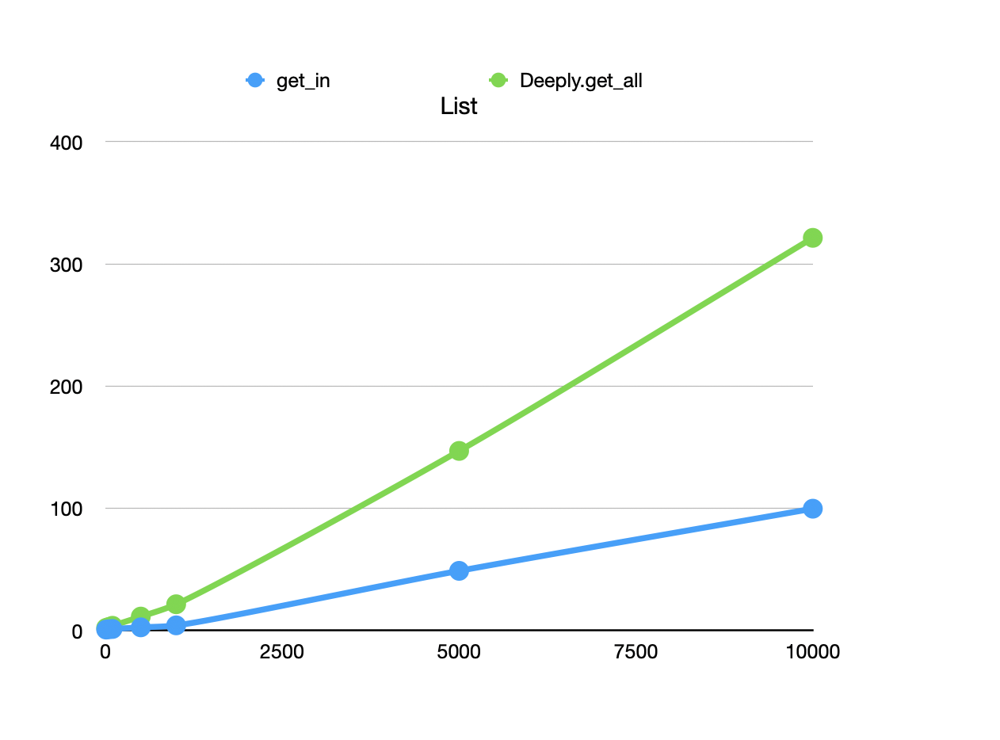

# Version 3: `get_and_update`

`Lens2.Deeply.get_and_update/3` is analogous to Elixir'sbuilt-in
`get_and_update_in/3`. As with `get_and_update`, it takes a function
that returns both an original value and its updated version:

    iex> returner = fn value -> {value, inspect(value)} end
    iex> Deeply.get_and_update(%{a: 1}, Lens.key(:a), returner)
    {[1], %{a: "1"}}

To implement this:

1. The descender function will, as before, take as its argument some
   container. But it will return a `{gotten, updated}` tuple.
   
2. A lens function will also return such a tuple to its caller.

3. `Deeply.get_and_update` calls a lens function and just returns the value:
   

Here is a new version of `at`. I'll highlight what's different from
the first version on this page (except for the tuple's curly braces):

    def at(index) do
      fn container, descender ->
        {gotten, updated} =
                 ^^^^^^^
          Enum.at(container, index)
          |> descender.()

        {[gotten], List.replace_at(container, index, updated)}
                   ^^^^^^^^^^^^^^^^^^^^^^^^^^^^^^^^^^^^^^^^^^
      end
    end
    
Not a very big change. The same can be done for `seq`:

    def seq(outer_lens, inner_lens) do
      fn outer_container, inner_descender ->
        outer_descender =
          fn inner_container ->
            inner_lens.(inner_container, inner_descender)
          end

        {gotten, updated} =
                 ^^^^^^^
          outer_lens.(outer_container, outer_descender)

        {Enum.concat(gotten), updated}
                              ^^^^^^^
      end
    end

## Record scratch noise

But wait. I've shown you three different versions of `at`, one for
each of `Deeply.get_all`, `Deeply.update`, and
`Deeply.get_and_update`. But there's a single `Lens.at` maker makes a
single lens, not different versions for different operations. After
all, the maker doesn't know how the lens it makes will be used. So how
does *that* work?

The answer is that lens makers produce the lens that works with
`Deeply.get_and_update` and the other operations build on that. Here's
the appropriate version of `update`:

  def get_and_update(container, lens, tuple_returner) do
    lens.(container, tuple_returner)
  end
    
It's the same as the `update` you saw in the previous main section,
except the name of the function has changed. (I don't think I've
*ever* used any form of `get_and_update` without forgetting it has to
return a tuple. Indeed, when I wrote the first version of
`get_and_update`, I forgot again and implemented a version that took
the same function as `update` and wrapped it in a tuple-returning
function.)

Indeed, it's `update` that has to turn an ordinary update function
into a tuple-returner, because it uses `get_and_update`:

    def update(container, lens, update_fn) do
      tuple_returner = & {&1, update_fn.(&1)}
      {_, updated} = get_and_update(container, lens, tuple_returner)
      updated
    end

`get_all` also calls `get_and_update`; it just returns the other tuple
element. But there's a problem: What tuple-returning function does it call?

    def get_all(container, lens) do
      tuple_returner = & {&1, ?????????}
      {gotten, _} = get_and_update(container, lens, tuple_returner)
      gotten
    end

There's a sense in which it doesn't matter, because whatever update
happens is thrown away. So it uses the most innocuous function
possible: the identity function:

      tuple_returner = & {&1, &1}

## Another record scratch noise

But wait. The `at` lens's return value is constructed like this:

      {gotten, updated} = ...

      {[gotten],
       List.replace_at(container, index, updated)  ### ‽‽‽‽‽
      }

Isn't `List.replace_at/3` going to construct a *new* list, one that's
identical to the old list?  And in a pipeline of lenses, won't there
be a whole series of lenses doing that – going to a lot of work to
construct a container that's `==` to the original container,
allocating memory like mad? only to throw away the newly-constructed
container?

Well, yes. In the case of `at`, that's exactly what
happens. Fortunately, composite structures like `Map`, structs, and
`MapSet` are clever enough not to allocate a new structure if they see
you're trying to `put` the same value that's already there. Instead,
they just return the original structure.

Still, for a large list (and other not-so-clever datetypes), there's
potentially a lot of wasted work. That means that `Deeply.get` might
get progressively slower than `get_in` as containers get bigger. 

I did some **extremely** crude benchmarking. For maps and structs,
lenses are about twice as slow as `Access` functions, and the
relationship seems constant(ish). For lists, lenses get slower and
slower as the lists get longer, but there's not an alarming "knee" in
the graph in, say, 4,000,000 repetitions of probes into an up to 10,000
element list:

The ancient advice applies: let profiling tell you where your problems are.

(`Access` avoids the problem of pointless updates by having two paths
through the equivalent of lens functions: one that's purely a "get"
and one that's a "get and update". It's a tradeoff.)

