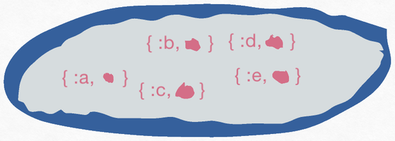
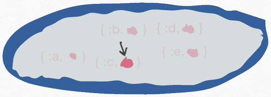

# Lenses move pointers

The word "lens" is a metaphor. We're supposed to gain some
understanding of what this particular software construct does, based on our
experience with physical lenses in the real world.

I never found the metaphor helpful when learning lenses. And since lenses
have the reputation of being hard to learn, I'm happy to abandon
it (while keeping the name everyone uses). To me, a more helpful metaphor is the *pointer*. In the picture below,
you see someone using a slim wooden stick to point to something on a
blackboard. The other picture shows an arrow – a pointer – pointing at a blob
with smaller blobs within it. These are – metaphorically – the same action.

[^1]

The right-hand image is of a data structure with smaller data
structures within it. I'm going to call the bigger structure a
*container*. The contained structures may also be containers that have
their own internal structure. Or they may be "atomic" values like integers or atoms.

The container has something pointing at it. Perhaps that's a variable
it's bound to via pattern matching:

```elixir
{:ok, container} = make_that_container(...)
```

Perhaps the pointer
indicates our container is part of a larger container, and the pointer represents
that you can go from the larger to the smaller, perhaps via constructs like these:

```elixir
larger.smaller
Map.get(larger, :smaller)
Enum.at(larger, 3)
```

**What a lens does is transform one set of pointers to another.** It 
takes a set of pointers to containers as its input. From them, it produces a new set of
pointers, typically to values within the original containers. Like this:


The lens is the "becomes" in the picture: the creation of the five pointers on the
right from the single pointer on the left. That is, a lens is a
*function*:


```elixir
iex> use Lens2     # sets up aliases `Lens` and `Deeply`
iex> Lens.at(3)
#Function<1.126734921/3 in Lens2.Lenses.Indexed.at/1>
```

... and `Lens.at` is a function-making (or "higher order")
function. I'm going to give such higher-order functions the name "lens
makers". It's kind of an ugly name, but it's important to remember the
difference between a lens function and the function that makes it.

Except when you're writing a new lens from scratch, your code never
calls a lens function directly. Instead, your code passes the lens to
some other function that does that work. As far as you're concerned,
the lens is no different than the `3` in `Enum.at(container, 3)` or
the `:a` in `Map.key(container, :a)`

To peek ahead, the functions that use lenses are in the `Lens2.Deeply` package (usually aliased as `Deeply`). Here's one:

```elixir
iex> Deeply.update([0, 1, 2], Lens.at(1), & &1 * 1111)
[0, 1111, 2]
```

I'm going to call such functions *operations* because they use lenses to operate on containers.

## Lenses are all about "zero, one, many"

Functions like `Map.get/3`, `Enum.at/2`, and so on are about a *single
value* within a container. Their conceptual extension to functions
like `get_in/2` share that assumption. There are
exceptions like `Access.all/0` or `Access.slice/1`, but I think it
fair to say those are special cases: both conceptually and in common
usage.

Lenses have a different base assumption: their code expects to be both
consuming and producing multiple pointers: maybe just one, maybe ten,
maybe even zero.

Let's look at some examples.

Here's a picture of a struct or a map or maybe a keyword list.




The
container contains a set of `{key, value}` tuples. In the case of a
keyword list, that's the literal, concrete representation. Maps might have
a different internal structure, but the values within a map are always
presented to the outside world as a tuple. Like this:

```elixir
iex> for elt <- %{a: 1, b: 2}, do: IO.inspect(elt)
{:a, 1}
{:b, 2}
```

To get a lens that converts a pointer-to-Map into pointers to all the values, you do this:

```elixir
iex> lens = Lens.map_values
```

(All my examples implicitly `use Lens2`, which provides the `Lens`
alias so that I don't have to write the function's real name,
`Lens2.Lenses.Keyed.map_values/0`.)

When it's used, the lens will produce these pointers for the container I showed above: 


You can use that lens to set every element in the container by
wrapping the lens in a singleton list and passing it to
`put_in/3`:

```elixir
iex> map = %{a: 1, b: 2, c: 3, d: 4, e: 5}
iex> put_in(map, [lens], :NEW)
                 ^^^^^^
%{c: :NEW, a: :NEW, d: :NEW, e: :NEW, b: :NEW}
     ^^^^     ^^^^     ^^^^     ^^^^     ^^^^
```

Similarly, you can use the lens with `get_in/2` and `update_in/3`):

```elixir
iex> get_in(map, [lens])
[3, 1, 4, 5, 2]
iex> update_in(map, [lens], & &1 * 1111)
%{c: 3333, a: 1111, d: 4444, e: 5555, b: 2222}
```

(I'll note here that `Access.all/0` can only be used on lists, so you
can't use out-of-the-box Elixir to do what we just did – except by coding manually the function that `Lens2.Lenses.Keyed.map_values/0` gives you for free. 

Having to wrap the lens in a list is a little annoying, so you can use
functions from `Lens2.Deeply` instead. (There are other reasons to use
them, which I'll cover later.)

Here's `Lens2.Deeply.put/3`:

```elixir
iex> Deeply.put(map, lens, :NEW)
%{c: :NEW, a: :NEW, d: :NEW, e: :NEW, b: :NEW}
```

-----

`Lens.map_values/0` points to all the map's values. Unsurprisingly,
you can point to just one value instead:

```elixir
iex> lens = Lens.key(:c)
```




And then you can update only `:c`'s value:

```elixir
iex> Deeply.update(map, lens, & 1111111*&1)
%{c: 3333333, a: 1, d: 4, e: 5, b: 2}
```

But let's see what happens if we use this new lens with `get_in/2`:

```elixir
iex> get_in(map, [lens])
[3]
```

That's weird. We wouldn't expect a list from this:


```elixir
iex> get_in(map, [:c])
3
```

... so why do we get it with a lens? It's because a lens used with
`get_in` might point to multiple elements of the container, so it's
always working internally with lists. If it treated singleton lists
differently (by unwrapping them), calling code couldn't distinguish
between a single value that *is* a list or a list of multiple
values. So everything stays in a list.

To remind you that you always get a list, the `Deeply` equivalent to
`get_in/2` is named `Lens2.Deeply.get_all/2`. I apologize in advance
for the number of times you'll habitually type `Deeply.get(...)` and
then be annoyed by this compiler error:

     Lens2.Deeply.get/2 is undefined or private. Did you mean:

           * get_all/2
           * get_only/2
     
Note `Lens2.Deeply.get_only/2`. If you're really truly sure you'll get
a singleton list, you can use it to unwrap the value for you. If it's
not a singleton list, `get_only` will raise an error.


-----

As a final example, you can point at a subset of the values:


```elixir
iex> lens = Lens.keys([:a, :e])
iex> Deeply.get_all(map, lens)
[1, 5]

```

This has *almost* the same behavior as `Map.take/2`, except the latter returns a map:

```elixir
iex> Map.take(map, [:a, :e])
%{a: 1, e: 5}
```

[^1]: The photo is via [Fagnar Brack](https://fagnerbrack.medium.com/personal-experience-doesnt-matter-cb060b42f99a). Found via a DuckDuckGo ["free to share and use" search](https://duckduckgo.com/?t=ffab&q=teacher+pointing+at+a+blackboard&atb=v196-1&iax=images&iai=https%3A%2F%2Fcdn-images-1.medium.com%2Fmax%2F2000%2F1*20JDS-KefsZFZoQlSqehaw.jpeg&ia=images&iaf=license%3AShare), although I couldn't find the specific license. 
