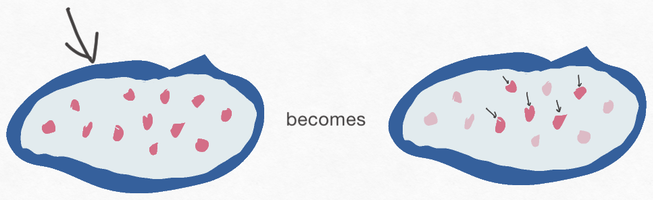
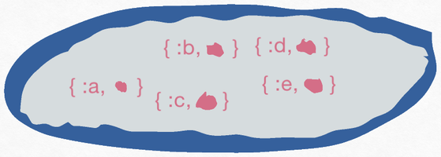
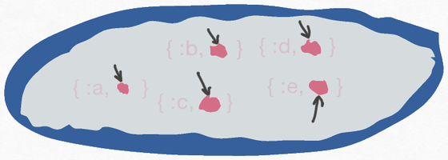
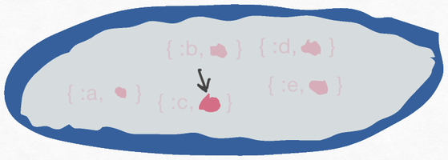
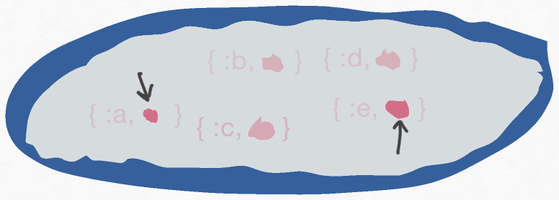

# Lenses move pointers

The word "lens" is a metaphor. We're supposed to gain some
understanding of what this particular software construct does, based on our
experience with physical lenses in the real world.

I never found the metaphor helpful when learning lenses. And since lenses
have the reputation of being hard to learn, I'm happy to abandon
it (while keeping the name everyone uses). To me, a more helpful metaphor is the *pointer*. In the picture below,
you see someone using a slim wooden stick to point to something on a
blackboard. The other picture shows an arrow – a pointer – pointing at a blob
with smaller blobs within it. These are – metaphorically – the same action.

[^1]

The right-hand image is of a data structure with smaller data
structures within it. I'm going to call the bigger structure a
*container*. The contained structures may also be containers that have
their own internal structure. Or they may be "atomic" values like integers or atoms.

The container has something pointing at it. Perhaps that's a variable
it's bound to via pattern matching:

```elixir
{:ok, container} = make_that_container(...)
```

Perhaps the pointer
indicates our container is part of a larger container, and the pointer represents
that you can go from the larger to the smaller, perhaps via constructs like these:

```elixir
larger.smaller
Map.get(larger, :smaller)
Enum.at(larger, 3)
```

**What a lens does is transform one set of pointers to another.** It 
takes a set of pointers to containers as its input. From them, it produces a new set of
pointers, typically to values within the original containers. Like this:




The lens is the "becomes" in the picture: the creation of the five pointers on the
right from the single pointer on the left. That is, a lens is a
*function*:


```elixir
iex> use Lens2     # sets up aliases `Lens` and `Deeply`
iex> Lens.at(3)
#Function<1.126734921/3 in Lens2.Lenses.Indexed.at/1>
```

... and `Lens.at` is a function-making (or "higher order")
function. I'm going to give such higher-order functions the kinda ugly
name "lens makers".

Except when you're writing a new lens from scratch, your code never
calls a lens function directly. Instead, your code passes the lens to
some other function that does that work. As far as you're concerned,
the lens is no different than the `3` in `Enum.at(container, 3)` or
the `:a` in `Map.key(container, :a)`

To peek ahead, the functions that use lenses are in the `Lens2.Deeply` package (usually aliased as `Deeply`). Here's one:

```elixir
iex> Deeply.update([0, 1, 2], Lens.at(1), & &1 * 1111)
[0, 1111, 2]
```

## Lenses are all about "zero, one, many"

Functions like `Map.get/3`, `Enum.at/2`, and so on are about a *single
value* within a container. Their conceptual extension to functions
like `get_in/2` share that assumption. There are
exceptions like `Access.all/0` or `Access.slice/1`, but I think it
fair to say those are special cases: both conceptually and in common
usage.

Lenses have a different base assumption: their code expects to be both
consuming and producing multiple pointers: maybe just one, maybe ten,
maybe even zero.

Let's look at some examples.

Here's a picture of a struct or a map or maybe a keyword list.




The
container contains a set of `{key, value}` tuples. In the case of a
keyword list, that's the literal, concrete representation. Maps might have
a different internal structure, but the values within a map are always
presented to the outside world as a tuple. Like this:

```elixir
iex> for elt <- %{a: 1, b: 2}, do: IO.inspect(elt)
{:a, 1}
{:b, 2}
```

To get a lens that converts a pointer-to-Map into pointers to all the values, you do this:

```elixir
iex> lens = Lens.map_values
```

(All my examples implicitly `use Lens2`, which provides the `Lens`
alias so that I don't have to write the function's real name,
`Lens2.Lenses.Keyed.map_values/0`.)

When it's used, the lens will produce these pointers for the container I showed above: 



You can use that lens to set every element in the container by
wrapping the lens in a singleton list and passing it to
`put_in/3`:

```elixir
iex> map = %{a: 1, b: 2, c: 3, d: 4, e: 5}
iex> put_in(map, [lens], :NEW)
                 ^^^^^^
%{c: :NEW, a: :NEW, d: :NEW, e: :NEW, b: :NEW}
     ^^^^     ^^^^     ^^^^     ^^^^     ^^^^
```

Similarly, you can use the lens with `get_in/2` and `update_in/3`):

```elixir
iex> get_in(map, [lens])
[3, 1, 4, 5, 2]
iex> update_in(map, [lens], & &1 * 1111)
%{c: 3333, a: 1111, d: 4444, e: 5555, b: 2222}
```

(I'll note here that `Access.all/0` can only be used on lists, so you
can't use out-of-the-box Elixir to do what we just did – except by coding manually the function that `Lens2.Lenses.Keyed.map_values/0` gives you for free. 

Having to wrap the lens in a list is a little annoying, so you can use
functions from `Lens2.Deeply` instead. (There are other reasons to use
them, which I'll cover later.)

Here's `Lens2.Deeply.put/3`:

```elixir
iex> Deeply.put(map, lens, :NEW)
%{c: :NEW, a: :NEW, d: :NEW, e: :NEW, b: :NEW}
```

-----

`Lens.map_values/0` points to all the map's values. Unsurprisingly,
you can point to just one value instead:

```elixir
iex> lens = Lens.key(:c)
```




And then you can update only `:c`'s value:

```elixir
iex> Deeply.update(map, lens, & 1111111*&1)
%{c: 3333333, a: 1, d: 4, e: 5, b: 2}
```

But let's see what happens if we use this new lens with `get_in/2`:

```elixir
iex> get_in(map, [lens])
[3]
```

That's weird. We wouldn't expect a list from this:


```elixir
iex> get_in(map, [:c])
3
```

... so why do we get it with a lens?


Right now, I want to
defer the answer to later, when it will be easier to explain. As a teaser, though, it's like the difference between using `Enum.map/2` and
`Enum.flat_map/2`, or between these two lists:

```
[[0, 1, 2], [3, 4, 5]]
[ 0, 1, 2,   3, 4, 5 ]
```

For now, just notice that there is no `Deeply.get`. Having a function
whose name implies "return a single value" actually return a list of
values is asking for confusion and bugs. Therefore, when using `Lens2.Deeply`,
you have two options.

`Lens2.Deeply.get_all/2` returns the list of values:

```elixir
iex> Deeply.get_all(map, Lens.key(:c))
[3]
```

If you're sure that there's a single value, you can use `Lens2.Deeply.get_only/2`:


```elixir
iex> Deeply.get_only(map, lens)
3
```

`get_only` will raise
an error for cases where there isn't exactly one value. Otherwise, it unwraps the singleton value and returns it.

-----

As a final example, you can point at a subset of the values:




```elixir
iex> lens = Lens.keys([:a, :e])
iex> Deeply.get_all(map, lens)
[1, 5]

```

This has *almost* the same behavior as `Map.take/2`, except the latter returns a map:

```elixir
iex> Map.take(map, [:a, :e])
%{a: 1, e: 5}
```

[^1]: The photo is via [Fagnar Brack](https://fagnerbrack.medium.com/personal-experience-doesnt-matter-cb060b42f99a). Found via a DuckDuckGo ["free to share and use" search](https://duckduckgo.com/?t=ffab&q=teacher+pointing+at+a+blackboard&atb=v196-1&iax=images&iai=https%3A%2F%2Fcdn-images-1.medium.com%2Fmax%2F2000%2F1*20JDS-KefsZFZoQlSqehaw.jpeg&ia=images&iaf=license%3AShare), although I couldn't find the specific license. 
