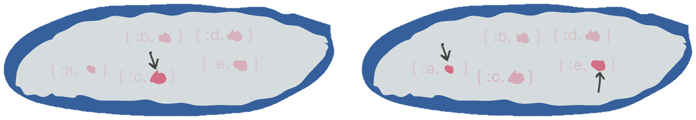
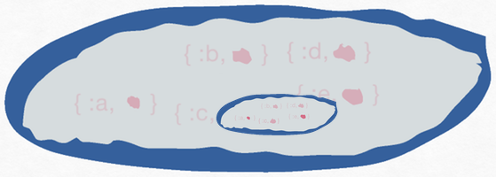
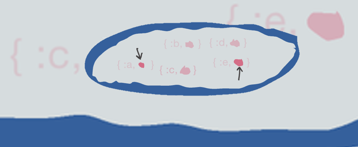

# Poking into nested containers

Lenses claim to fame is the ability to descend through nested data
structures in a variety of ways, for a variety of structures. This
page is about how that's done.

# Composing lens *makers*

Lens-creating functions can be combined using the pipe (`|>`)
function.

Suppose I've `use`d `Lens2` and so can refer to lens-maker functions
with `Lens`. Here, again, are pictures showing the pointed-at values
from applying, respectively, `Lens.key(:c)` and `Lens.key([:a, :e])`
to two copies of the same five-element map.




However, let's suppose the second map is actually embedded within the first, as the value of the key `:c`:




We want the pointers into that nested map, specifically at the values of the `:a` and `:e` keys:




That's easy to do by composing the Lens-making functions:


```elixir
iex>  lens = Lens.key(:c) |> Lens.keys([:a, :e])
#Function<13.52599976/3 in Lens2.Lenses.Combine.seq/2>
```

Let's see the new composed lens at work.

```elixir
iex>  map = %{a: 1, b: 2, c: 3, d: 4, e: 5}
%{c: 3, a: 1, d: 4, e: 5, b: 2}
iex>  nested = %{map | c: map}
%{c: %{c: 3, a: 1, d: 4, e: 5, b: 2}, a: 1, d: 4, e: 5, b: 2}

iex>  Deeply.get_all(nested, lens)
[1, 5]
iex>  Deeply.put(nested, lens, :NEW)
%{c: %{c: 3, a: :NEW, d: 4, e: :NEW, b: 2}, a: 1, d: 4, e: 5, b: 2}
                ^^^^           ^^^^
```

# Another example: filtering pointers

I lied by omission about the example map. I didn't mention that it's
more accurate to consider the map a container of *tuples*, each of
which contains two values: the first element (key) and the second
(value).

To see this, you can use `Lens.all` to get the tuples:

```elixir
iex>    map = %{a: 1, b: 2, c: 3, d: 4, e: 5}
iex>    Deeply.get_all(map, Lens.all)
[c: 3, a: 1, d: 4, e: 5, b: 2]
```

We've gotten back a list of tuples, which is the definition of a `Keyword` list. To make it clearer, let's use a map with non-atom keys:

```elixir
iex>  map = %{[:a] => 1, [:b] => 2}
%{[:a] => 1, [:b] => 2}
```

Now the `Inspect` protocol highlights the tuples:

```elixir
iex>  Deeply.get_all(map, Lens.all)
[{[:a], 1}, {[:b], 2}]
```

As containers, tuples have lenses that apply to them. For example,
`Lens2.Indexed.at/1` will take the nth element of a `Tuple` (as well
as of any `Enumerable`):

```elixir
iex>  Deeply.get_only({:key, :value}, Lens.at(1))
:value
```

What this means is that it seems like `Lens2.Keyed.map_values/0` be defined by the
composition of lenses:

```elixir
iex(9)>  Deeply.get_all(map, Lens.all |> Lens.at(1))
[1, 2]
```

But not quite, because `Deeply.put` (or `put_in/3`) produces an odd result:

```elixir
iex>  put_in(map, [Lens.all |> Lens.at(1)], :NEW)
[{[:a], :NEW}, {[:b], :NEW}]
```

What's happening here? 

Consider how you might write your own code to `put` all the values of a map. 
First, you'd iterate over the elements of the map. I'll use `for/1`:

```elixir
for {key, value} <- map do
  # ...
end
```

Within the body of the `for`, you'd set the value of the tuple's second element:

```elixir
for {key, _overwritten} <- map do
  {key, :NEW}
end
```

That produces this:

```
[{[:a], :NEW}, {[:b], :NEW}]
```

The problem is there's no code to reconstitute from the list of
tuples. `for/1` has a way to handle that, the `:into` clause:

```elixir
for {key, _overwritten} <- map, into: %{} do
  {key, :NEW}                   ^^^^^^^^^
end

# returns:
%{[:a] => :NEW, [:b] => :NEW}
```

Working with nested containers is inherently a recursive
operation. `Lens.all` is the first level of recursion. When applied to
a `Map`, it produces tuples. These it passes to the second level,
which deals with individual tuples. But what is the `Lens.all` code to
do with the second level's return values? 


# Making composing lenses just as easy


lens |> lens2 

Lens.key(:a) |> Lens.keys([:a, :b])


Lens.keys(Lens.key(:a), [:a, :b])

lens2.(lens1)


feeding the lens function into another lens function, when that function expects a container.


That's different from feeding a lens into a *lens maker*.


`lens` is a pointer to a function.
`lens


composing the function pointed at by `Lens.


