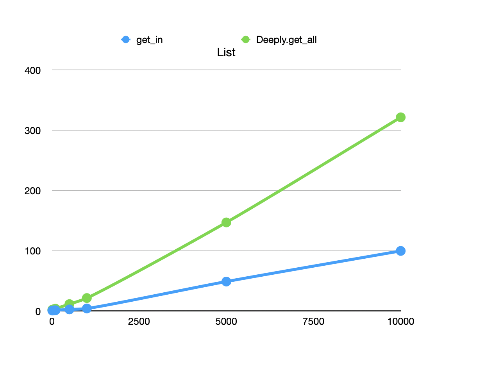

# How lenses work

> I really hate this damn machine.    
> I wish that they would sell it.    
> It never does quite what I want,     
> But only what I tell it.    
> – Traditional    

When using simple composed lenses like `Lens.key(:a) |>
Lens.keys([:aa, :bb])`, you don't have to understand what's happening
behind the scenes. The lens descends through key `:a`, then through
keys `:aa` and `:bb`, and either returns a list of values or an
updated complete container.

But sometimes – especially if you use some of the more unusual
combining lenses – you'll get surprised. I've reluctantly concluded
that the surest way to un-perplex yourself is to work through the
detailed steps of what's happening in the lens code. To do that, you
need to understand lenses well enough to write one from
scratch. That's what this section is about.

Note: you might want to defer reading this page until you actually
*are* perplexed or need to write a lens. Maybe you'll never need it!

The lens implementation is somewhat conceptually tricksy, so I'll work my way up to full
complexity. I'll start with an implementation that works for
`Deeply.get`, then I'll expand it to work with `Deeply.update` and
related operations.  I'll finish with some explanations of why
particular compositions work as they do.

## Version 1: `get_all`

Suppose we want to make this work:

    iex> get_all(["0", "1"], at(1))
    ["1"]
    
(I'm not using the `Deeply` or `Lens` because I'm showing you simplified versions of the real ones.)
    
The lens is a function, so let's have `get_all` just call it:

    def get_all(container, lens) do
      lens.(container)
    end

Then the lens-maker `at/1` just returns a function that takes a container and does its thing:

    def at(index) do
      fn container ->
        gotten = Enum.at(container, index)
        [gotten]
      end
    end
    
Notice that this version of `at` only works with lists, whereas the
real one also works with tuples.
    
Notice that the result of `Enum.at` is wrapped in a list, because
that's the contract a lens must follow. There has to be a way to
distinguish between returning a list of values and a single value
that's a list. That's done by wrapping everything in a list, so that a
single value that's a list is returned like this:

    [ [0, 1, 2] ]
    
... which is distinct from two values that are lists:

    [ [0, 1, 2], [3, 4, 5] ]
    
... or six independent values (as you might get from `Lens2.Lenses.Enum..all/0`):

    [ 0, 1, 2, 3, 4, 5 ]

However, lenses are meant to be used in pipelines like this:

    lens = at(1) |> at(2)
    
The code for `at` given above assumes it's at the end of a
pipeline. That can't work: it may, but it may not be. It has to work
in both cases.

Since the lens can't know where it is in a pipeline, it needs to be
told what to do after it finishes extracting a value from inside a
container. It might be told to return that value (as in the `at`
above), or it might be told to pass the value to the next lens, for it
to work with as *its* container.

This is done by passing a second argument to the lens function:

    def at(index) do
      fn container, descender ->
                    ^^^^^^^^^
        gotten =
          (Enum.at(container, index))
          |> descender.()
          ^^^^^^^^^^^^^^^
        [gotten]
      end
    end

The descender encapsulates the knowledge of what to do with an
extracted value. It's not the best name, since "what to do" might be
"just return it", not "descend deeper into the extracted value", but I
can't think of a better one. (This code and what follows, plus tests,
can be found
[here]((../test/mostly_words/tutorial/by_hand_get_test.exs)).

The need to handle the `get_all(..., at(1))` case means that `get_all` must pass the identity function to its lens:

    def get_all(container, lens) do
      getter = & &1
      lens.(container, getter)
    end

If `lens` is an isolated lens like a solitary, unpipelined `at`, by
calling the descender with the extracted value, it's really returning
the extracted value.

But what happens in the case where the `at` lens is followed by other
pipelined lenses? *Something* sitting between `get_all` and the `at`
lens has to create a new descender.

### seq

That job is done by `seq`. Recall that the pipeline `at(1) |> at(2)`
is syntactic sugar for this expression:

    seq(at(1), at(2)
    
So we need to figure out the definition of `seq`. 

Since the result of `seq` is a lens that combines two lenses, it has to have this form:

    def seq(lens1, lens2) do
      fn container, descender ->
        ...
      end
    end
    
From the point of view of `get_all`, the function that `seq` returns
is a single lens with a single `container` and `descender`. But from
the point of view of `seq` itself, it has two lenses, each with a
container and descender. `seq`'s first argument is the container for
the *first* lens, but its second argument is the descender for the
*second*. Let's make that explicit. 

I'm going to refer to the *outer* and *inner* lenses, because lenses are
all about descending *into* structures. So:

    def seq(outer_lens, inner_lens) do
            ^^^^^^^^^^  ^^^^^^^^^^
      fn outer_container, inner_descender ->
         ^^^^^^^^^^^^^^^^ ^^^^^^^^^^^^^^^
      end
    end
    
Since no `outer_descender` is given, the `seq` code will have to make some. That is, it
must look like this:
    
    def seq(outer_lens, inner_lens) do
      fn outer_container, inner_descender ->
        outer_descender = fn ... end                     # <<

        gotten = 
          outer_lens.(outer_container, outer_descender)  # <<

        ???? calculate the return value
      end
    end
    

The `outer_descender`, passed to the `outer_lens`, must tell
`outer_lens` to call the `inner_lens` with whatever value the `outer_lens`
extracts from the `outer_container`. (What value that is, is none of `seq`'s business.)

    def seq(outer_lens, inner_lens) do
      fn outer_container, inner_descender ->
        outer_descender =                                  # <<
          fn inner_container ->                            # <<
            inner_lens.(inner_container, inner_descender)  # <<
          end                                              # <<

        gotten = 
          outer_lens.(outer_container, outer_descender)

        ???? calculate the return value
      end
    end

### The return value

We still have to know how `seq` calculates its return value. To see
what happens, consider this call:

    iex> lens = at(1) |> at(2)
    iex> get_all([0, [0, 1, "TARGET"]])
    
    
I'll substitute in the literal values into the code for `seq` to get:

          at(1).([0, [0, 1, "TARGET"]], fn inner_container ->
          ^^^^^
             at(2).(inner_container, & &1)
             ^^^^^                   ^^^^
          end
          
`at(1)` gets called first. When it executes, it'll run this code:

        gotten =
          Enum.at([0, [0, 1, "TARGET"]], 1)
          |> (fn inner_container ->
                at(2).(inner_container, & &1).()
          
        [gotten]

We can evaluate the `Enum.a` expression and simplify:

        gotten =
          at(2).([0, 1, "TARGET"], & &1)
        [gotten]

Let's inline `at(2)`:

        gotten =
          (
            gotten = 
              Enum.at([0, 1, "TARGET"], 2)
              |> (& &1).()
            [gotten]
          )
        [gotten]

or: 

        gotten =
          (
            gotten = 
              "TARGET"
              |> (& &1).()
            [gotten]
          )
        [gotten]

or:

        gotten =
          (
            gotten = 
              "TARGET"
            [gotten]
          )
        [gotten]

or: 

        gotten =
          ["TARGET"]
        [gotten]
        
or:

        [["TARGET"]]

That would be the wrong value for `seq`: there's an extra level of
wrapping. So `seq` uses `Enum.concat` to fix things up:

    def seq(outer_lens, inner_lens) do
      fn outer_container, inner_descender ->
        outer_descender =                                  
          fn inner_container ->                            
            inner_lens.(inner_container, inner_descender)  
          end                                              

        gotten = 
          outer_lens.(outer_container, outer_descender)

        Enum.concat(gotten)                             # <<
      end
    end

So a pipeline involves lenses wrapping too much and `seq` fixing their results.

### The garden of forking paths

> With apologies to [Jorge Luis Borges](https://en.wikipedia.org/wiki/The_Garden_of_Forking_Paths)

The previous example was linear: the code descended to a single
"leaf" node, then returned the value found, wrapping and unwrapping as
needed. But lenses are built on the assumption that a single `Deeply`
operation may require the lenses to descend to a leaf, retreat to some
intermediate position in the container, descend again to another leaf,
retreat again, and so on.

Here's a simple example:

    iex> nested = [ [0, 1, 2], [0, 1111, 2222]] 
    iex> lens = Lens.all |> Lens.at(1)
    iex> Deeply.get_all(nested, lens)
    [1, 1111]
    
The question is: how is it arranged such that the result is `[1, 1111]`
and not something like `[[1], [1111]]`? It turns out to be pretty
simple. That is, lenses that "naturally" return lists don't have to do
anything special.

Here's a version of `all` that works with the makers we previously defined:

    def all do
      fn container, descender ->
        for item <- container, do: descender.(item)
      end
    end

Following the simple example, we'll examine how it fits in with this composed lens:

    seq(all(), at(1))
    
The `all()` lens will be given this descender:

          fn outer_container -> 
            at(1).(outer_container, & &1)
            ^^^^^                   ^^^^
          end

This will be called many times in `all`'s `for` comprehension, each
time returning a singleton list. So after `seq` executes this:

        gotten = 
          all().(outer_container, outer_descender)

... `gotten` will be bound to something like this:

        [ [1], [2] ]
        
Not-at-all coincidentally, `seq`'s ending `Enum.concat(gotten)` will produce the desired list:

        [  1,  2   ]

### Summary 

When it comes to "getting", every lens function has three jobs, in order:

1. The function is given a container and must select (point to) zero or more
   elements of that container.

   
2. It must pass those 0, 1, or _n_ extracted elements to... it can't
   be sure. But it doesn't matter. Just to some `descender` function
   given to it. All the logistics about where the lens is in a
   pipeline are handled by its caller.

   
3. It must ensure the return value is a list. If it operates on a
   single element, it must wrap it into a singleton list.
   
   
Only the last job differs for `Deeply.update` and similar
functions. It turns out the change is easy.

## Version 2: Update

Because updating and getting work so similarly, we can use the
previous major section as a model – but speed through it.

An `update` operation looks almost like `get_all`, except that the
identify function is replaced with the update function passed in:

    def update(container, lens, update_fn) do          def get_all(container, lens) do
                                ^^^^^^^^^
      lens.(container, update_fn)                        lens.(container, & &1)
                       ^^^^^^^^^                                          ^^^^
    end                                                end

(A `put` operation is the same, except that it codes up a constant-returning update function:

    def put(container, lens, constant) do
      lens.(container, fn _ -> constant end)
    end

I won't mention `put` any more.)

We can make a similar small change to `at` to make it work with `update`. Instead of returning an extracted element (wrapped in a list), we `put` the new element in the given index:

    def at(index) do                                    def at(index) do
      fn container, descender ->                          fn container, descender ->
        updated =                                           gotten = 
          Enum.at(container, index)                           Enum.at(container, index)
          |> descender.()                                     |> descender.()

        List.replace_at(container, index, updated)          [gotten]
        ^^^^^^^^^^^^^^^^^^^^^^^^^^^^^^^^^^^^^^^^^^          ^^^^^^^^
      end                                                 end
    end                                                 end

You may wonder why I didn't use just `List.update`, as in:

    def at(index) do
      fn container, descender ->
        List.update_at(container, index, descender)
      end
    end

That would work just as well, but I'm using the other form for two reasons:

1. You may have noticed that this new version of `at` won't work with
   `get_all`. The next major section will fix that by taking advantage
   of the structural similarity between the two versions.
   
2. In both versions, the effect the effect is to descend into the
   container, do something, then retreat up out of the container,
   adjusting each successive container. But separating the `Enum.at` from the
   `List.replace_at` makes the sequence of events clearer.
   That is, consider this container:
   
        iex>     container =
        ...>         [
        ...>           [0],
        ...>           [
        ...>             [00],
        ...>             [11],
        ...>             [
        ...>               :---, :---, :---, 333
        ...>             ],
        ...>           [33]
        ...>          ],
        ...>          [2],
        ...>          [3]
        ...>        ]

   I want to change the triply-nested element `333`. I can't pipe my
   homegrown `at`-makers together because I used `def` instead of the
   `Lens2.Makers.def_maker/2` macro that would create the
   extra-argument version of `at` that works in a pipeline. So, I'll use
   `seq` again:
   
        iex> lens = seq(at(1), seq(at(2), at(3)))
       
    Now what happens during this?
    
        iex> update(container, lens, & &1 * 10000100001)
       
    1. The composed lens descends (via `Enum.at(..., 1`) and passes this interior container
       to its `descender`:
       
                  [
                    [00],
                    [11],
                    [
                      :---, :---, :---, 333
                    ],
                    [33]
                  ],
       
    2. The descender uses the `at(2)` lens to extract this:
    
                    [
                      :---, :---, :---, 333
                    ]

       ... and calls its descender.
    
    3. And the `at(3)` uses `Enum.at(..., 3)` to extract `333`, which – as usual – goes to its
       descender.
    4. But that descender is `& &1 * 10000100001`, which yields `3330033300333`. That is
       returned.
    5. Now the retreat begins. The new value replaces the 333 to yield:
    
                    [
                      :---, :---, :---, 3330033300333
                    ]
    5. The retreat continues, and *that* value is replaced in the `[00, 11, ... 33]` list.
    6. And the same happens in the top level.
    
    Descend, descend, descend, update, replace, replace, replace.    
    At, at, at, update, replace_at, replace_at, replace_at

Now, at this point, that won't actually work because our version of
`seq` unwraps what's assumed to be a doubly-wrapped list of gotten
values. So another one-line change is needed, to replace `Enum.concat`
with a plain return value:

      def seq(outer_lens, inner_lens) do
        fn outer_container, inner_descender ->
          outer_descender =
            fn inner_container ->
              inner_lens.(inner_container, inner_descender)
            end
    
          updated =
            outer_lens.(outer_container, outer_descender)

          updated                                          # Used to be `Enum.concat(gotten)`
          ^^^^^^^
        end
      end

And that's it!

## Version 3: `get_and_update`

`Lens2.Deeply.get_and_update/3` is analogous to Elixir'sbuilt-in
`get_and_update_in/3`. As with `get_and_update`, it takes a function
that returns both an original value and its updated version:

    iex> returner = fn value -> {value, inspect(value)} end
    iex> Deeply.get_and_update(%{a: 1}, Lens.key(:a), returner)
    {[1], %{a: "1"}}

To implement this:

1. The descender function will, as before, take as its argument some
   container. But it will return a `{gotten, updated}` tuple.
   
2. A lens function will also return such a tuple to its caller.

3. `Deeply.get_and_update` calls a lens function and just returns the value:
   

Here is a new version of `at`. I'll highlight what's different from
the first version on this page (except for the tuple's curly braces):

    def at(index) do
      fn container, descender ->
        {gotten, updated} =
                 ^^^^^^^
          Enum.at(container, index)
          |> descender.()

        {[gotten], List.replace_at(container, index, updated)}
                   ^^^^^^^^^^^^^^^^^^^^^^^^^^^^^^^^^^^^^^^^^^
      end
    end
    
Not a very big change. The same can be done for `seq`:

    def seq(outer_lens, inner_lens) do
      fn outer_container, inner_descender ->
        outer_descender =
          fn inner_container ->
            inner_lens.(inner_container, inner_descender)
          end

        {gotten, updated} =
                 ^^^^^^^
          outer_lens.(outer_container, outer_descender)

        {Enum.concat(gotten), updated}
                              ^^^^^^^
      end
    end

### Record scratch noise

But wait. I've shown you three different versions of `at`, one for
each of `Deeply.get_all`, `Deeply.update`, and
`Deeply.get_and_update`. But there's a single `Lens.at` maker makes a
single lens, not different versions for different operations. After
all, the maker doesn't know how the lens it makes will be used. So how
does *that* work?

The answer is that lens makers produce the lens that works with
`Deeply.get_and_update` and the other operations build on that. Here's
the appropriate version of `update`:

  def get_and_update(container, lens, tuple_returner) do
    lens.(container, tuple_returner)
  end
    
It's the same as the `update` you saw in the previous main section,
except the name of the function has changed. (I don't think I've
*ever* used any form of `get_and_update` without forgetting it has to
return a tuple. Indeed, when I wrote the first version of
`get_and_update`, I forgot again and implemented a version that took
the same function as `update` and wrapped it in a tuple-returning
function.)

Indeed, it's `update` that has to turn an ordinary update function
into a tuple-returner, because it uses `get_and_update`:

    def update(container, lens, update_fn) do
      tuple_returner = & {&1, update_fn.(&1)}
      {_, updated} = get_and_update(container, lens, tuple_returner)
      updated
    end

`get_all` also calls `get_and_update`; it just returns the other tuple
element. But there's a problem: What tuple-returning function does it call?

    def get_all(container, lens) do
      tuple_returner = & {&1, ?????????}
      {gotten, _} = get_and_update(container, lens, tuple_returner)
      gotten
    end

There's a sense in which it doesn't matter, because whatever update
happens is thrown away. So it uses the most innocuous function
possible: the identity function:

      tuple_returner = & {&1, &1}

### Another record scratch noise

But wait. The `at` lens's return value is constructed like this:

      {gotten, updated} = ...

      {[gotten],
       List.replace_at(container, index, updated)  ### ‽‽‽‽‽
      }

Isn't `List.replace_at/3` going to construct a *new* list, one that's
identical to the old list?  And in a pipeline of lenses, won't there
be a whole series of lenses doing that – going to a lot of work to
construct a container that's `==` to the original container,
allocating memory like mad? only to throw away the newly-constructed
container?

Well, yes. In the case of `at`, that's exactly what
happens. Fortunately, composite structures like `Map`, structs, and
`MapSet` are clever enough not to allocate a new structure if they see
you're trying to `put` the same value that's already there. Instead,
they just return the original structure.

Still, for a large list (and other not-so-clever datetypes), there's
potentially a lot of wasted work. That means that `Deeply.get` might
get progressively slower than `get_in` as containers get bigger. 

I did some **extremely** crude benchmarking. For maps and structs,
lenses are about twice as slow as `Access` functions, and the
relationship seems constant(ish). For lists, lenses get slower and
slower as the lists get longer, but there's not an alarming "knee" in
the graph in, say, 4,000,000 repetitions of probes into an up to 10,000
element list:

The ancient advice applies: let profiling tell you where your problems are.

(`Access` avoids the problem of pointless updates by having two paths
through the equivalent of lens functions: one that's purely a "get"
and one that's a "get and update". It's a tradeoff.)

## Compatibility with `Access`

To be compatible with `Access`, lens makers like `at/1` are defined
with the `Lens2.Makers.def_maker/2` macro. That macro does two things:

1. It defines a hidden `at/2` function that takes a lens as its first
   argument. It looks like this:
   
       def at(previous, index) do 
         seq(previous, at(index))
       end
       
   ... so that `at(0) |> at(1)` becomes `Lens.seq(at(0), at(1))`. 
   

2. It wraps definitions of the form we've been using above: 

        lens = fn container, descender -> ... end

   ... in a
   function that's compatible with the `Access` behaviour:
   
        fn
          :get, container, continuation -> ...
          :get_and_update, container, tuple_returner -> ...
        end
          
   The `:get_and_update case is simplest:
           
          :get_and_update, container, tuple_returner -> 
            lens.(container, tuple_returner)

   That's the same as the `get_and_update` function above, except for
   the atom used to separate this pattern from the `:get` patterns
   (since the types of the second and third arguments are the same in
   both patterns).
   
   Essentially, this is an "extract method" refactoring of the version
   three `get_and_update`, leaving this behind: 
   
   
        def get_and_update(container, lens, tuple_returner) do
          get_and_update_in(container, [lens], tuple_returner)
        end
        
        
        
        
          
        fn
          :get, container, continuation ->
            {gotten, _} = lens.(container, & {&1, &1})
            continuation.(gotten)

           

     

## `Lens.into`

## `Lens.const`